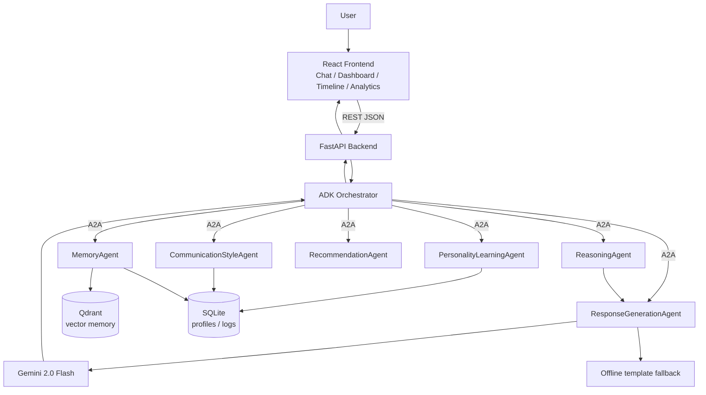

# Architecture

## Component diagram

## Layer responsibilities

| Layer | Responsibility |
|---|---|
| **React Frontend** | All 8 required pages; talks only to FastAPI over REST |
| **FastAPI Backend** | Thin HTTP layer; validates requests, delegates to orchestrator |
| **ADK Orchestrator** | Sequences the 6 agents for each turn; owns the conversation log |
| **Multi-Agent Layer** | Domain logic, isolated per agent, communicating via A2A messages |
| **Memory Layer** | Qdrant (vectors) + SQLite (metadata) — the durable long-term memory |
| **Gemini** | Final natural-language generation, styled by the agent pipeline |

## Data flow per chat turn

1. `MemoryAgent.retrieve_similar` — embed the query, semantic search Qdrant scoped to `user_id`
2. `PersonalityLearningAgent.get_profile` / `CommunicationStyleAgent.get_style_profile` — load learned profile
3. `RecommendationAgent.generate_recommendations` — frequency-based suggestions from retrieved memories
4. `ReasoningAgent.reason` — compute the Confidence Score + explanation
5. `ResponseGenerationAgent.generate` — call Gemini (or offline fallback) with full context, or return a clarification question if confidence is low
6. `PersonalityLearningAgent` / `CommunicationStyleAgent` re-learn from the new user message (continuous improvement)
7. `MemoryAgent.store_memory` — persist the turn as a new memory (embedded + upserted into Qdrant)
8. Orchestrator writes a `ConversationLog` row for `/analytics`

Every one of these hops is logged through `TraceLogger` and tagged with a shared `trace_id`, which is how the Agent Activity Logs page reconstructs the full multi-agent trace for a single message.
