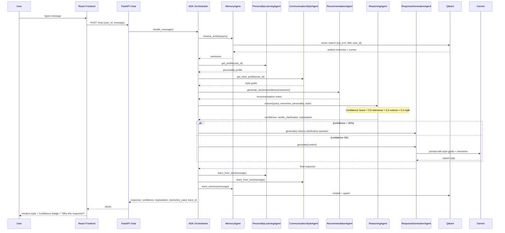

# Sequence Diagram — One Chat Turn

```mermaid
sequenceDiagram
    participant User
    participant FE as React Frontend
    participant API as FastAPI /chat
    participant O as ADK Orchestrator
    participant MEM as MemoryAgent
    participant PER as PersonalityLearningAgent
    participant STY as CommunicationStyleAgent
    participant REC as RecommendationAgent
    participant REA as ReasoningAgent
    participant RES as ResponseGenerationAgent
    participant QD as Qdrant
    participant GEM as Gemini

    User->>FE: types message
    FE->>API: POST /chat {user_id, message}
    API->>O: handle_message()
    O->>MEM: retrieve_similar(query)
    MEM->>QD: vector search (top_k=5, filter user_id)
    QD-->>MEM: ranked memories + scores
    MEM-->>O: memories

    O->>PER: get_profile(user_id)
    PER-->>O: personality profile
    O->>STY: get_style_profile(user_id)
    STY-->>O: style guide

    O->>REC: generate_recommendations(memories)
    REC-->>O: recommendation notes

    O->>REA: reason(query, memories, personality, style)
    Note over REA: Confidence Score = 0.5·relevance + 0.3·volume + 0.2·style
    REA-->>O: confidence, needs_clarification, explanation

    alt confidence < 45%
        O->>RES: generate() returns clarification question
    else confidence OK
        O->>RES: generate(context)
        RES->>GEM: prompt with style guide + memories
        GEM-->>RES: styled reply
    end
    RES-->>O: final response

    O->>PER: learn_from_text(message)
    O->>STY: learn_from_text(message)
    O->>MEM: store_memory(message)
    MEM->>QD: embed + upsert

    O-->>API: response, confidence, explanation, memories_used, trace_id
    API-->>FE: JSON
    FE-->>User: renders reply + Confidence badge + "Why this response?"
```
